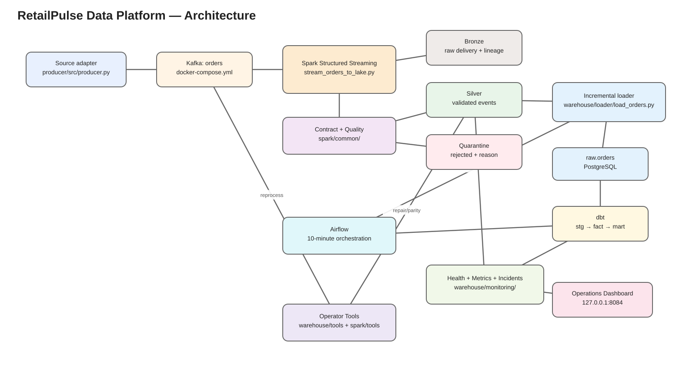

# RetailPulse Data Platform

RetailPulse is a production-style streaming data-engineering reference implementation for ingesting events, validating them, persisting a replayable lake, loading an analytical warehouse, transforming it with dbt, orchestrating it with Airflow, and operating it with health checks, incidents, metrics, alerts, replay and recovery tooling.

The included domain is synthetic e-commerce orders, but the repository is deliberately structured as a reusable skeleton: replace the source adapter, contract, domain-quality rules and dbt models while retaining the same Kafka → Spark → lake → warehouse → orchestration → observability workflow.



## What the platform demonstrates

- Event ingestion through Apache Kafka.
- Spark Structured Streaming to Bronze, Silver and Quarantine Parquet datasets.
- Versioned event-contract validation and domain data-quality validation.
- At-least-once physical delivery with exactly-once logical warehouse effect by `event_id`.
- Committed-file authority using Spark `_spark_metadata` rather than raw filesystem globbing.
- Incremental, watermark-aware Silver → PostgreSQL loading with backfill and replay modes.
- dbt staging, incremental fact modelling, business marts and tests.
- Airflow run lineage, retries, timeouts and failure recording on a 10-minute schedule.
- Cross-layer reconciliation, freshness SLOs, incidents and email alert/recovery notifications.
- An operator-facing terminal view and local operations dashboard.
- Quarantine remediation and targeted historical repair tools.
- Analytical-layer disaster recovery proven by destructive rebuild and replay.
- Docker Compose infrastructure, environment-driven configuration and CI quality gates.

## Implementation journey

RetailPulse was built incrementally across **30 engineering sessions**, progressing from a local PostgreSQL foundation to a fully validated v1 streaming platform.

```text
Sessions 01–05  Foundation & core data path
                PostgreSQL → Kafka → Spark → lake → incremental loader

Sessions 06–10  Analytics, orchestration & resilience
                dbt → Airflow → CI → health monitoring → recovery testing

Sessions 11–15  Correctness under real pipeline edge cases
                SLOs → replay → schema evolution → event time → duplicate delivery

Sessions 16–20  Remediation, lineage & incident operations
                quarantine repair → audit trail → run lineage → incidents → alerts

Sessions 21–25  Operator experience & runtime hardening
                dashboard → quality framework → monitoring fixes → retry policy → secrets

Sessions 26–30  Production readiness & v1 completion
                service readiness → scale testing → optimisation → DR → 1M-event validation
```

The complete topic/outcome index is in [Implementation Overview](docs/architecture/IMPLEMENTATION_OVERVIEW.md), with each entry linked to its detailed historical runbook under [`docs/sessions/`](docs/sessions/).

## Validated scale

The v1 production-readiness exercise included a 20-event smoke test followed by a 1,000,000-event burst.

| Measure | Result |
|---|---:|
| Burst produced | 1,000,000 events |
| Producer elapsed time | 686.04 s |
| Producer throughput | 1,457.6 events/s |
| First scheduled warehouse catch-up | 730,822 inserted |
| Second scheduled warehouse catch-up | 269,178 inserted |
| Total burst inserted | 1,000,000 |
| Final logical events | 1,029,150 |
| Final Raw / Fact / Gold | 1,029,150 / 1,029,150 / 1,029,150 |
| Strict health runtime at 1M+ logical events | 7.88 s |
| Final state | `HEALTHY` |

The first large catch-up run deliberately finished `FAILED` because strict reconciliation observed a temporary Silver → Raw lag while the downstream warehouse was still catching up. The already committed 730,822 inserts were retained. The next scheduled run inserted the remaining 269,178 rows and the platform automatically converged to `HEALTHY` without manual repair. This is a useful demonstration of resumable, eventually convergent processing under burst load rather than a claim of high availability or unlimited production capacity.

## Data flow

```text
Source adapter
producer/src/producer.py
        │
        ▼
Kafka topic: orders
        │
        ▼
Spark Structured Streaming
spark/jobs/stream_orders_to_lake.py
        │
        ├──────────────► Bronze
        │                 raw Kafka envelope + payload
        │
        ├─ contract + quality validation
        │
        ├──────────────► Silver
        │                 valid analytical events
        │
        └──────────────► Quarantine
                          rejected events + reason

Silver
  │
  ▼
warehouse/loader/load_orders.py
  │
  ▼
raw.orders
  │
  ▼
dbt: stg_orders → fct_orders → mart_daily_sales
  │
  ▼
health / metrics / incidents / dashboard
  │
  ▼
Airflow orchestration every 10 minutes
```

See [Architecture](docs/architecture/ARCHITECTURE.md) and [Data Flow](docs/architecture/DATA_FLOW.md) for the detailed design.

## Reliability model

RetailPulse intentionally separates physical delivery from logical business state.

```text
Kafka / Spark / Silver physical delivery
        = at-least-once

raw.orders / fct_orders / mart business state
        = exactly-once logical effect by event_id
```

Key invariants:

```text
Bronze = Silver + Quarantine              (when fully caught up)
Silver unique event_id = raw.orders
raw.orders = analytics.fct_orders
analytics.fct_orders = SUM(mart_daily_sales.order_count)
```

Physical Silver duplicates are allowed. Duplicate business events are not. `raw.orders.event_id` is the logical idempotency boundary and `analytics.fct_orders(event_id)` has a dbt-managed unique B-tree index.

## Repository structure

The tree below shows the implementation modules that matter for build, operation and handover. Test suites are intentionally summarized at directory level.

```text
retailpulse-data-platform/
├── .env.example
├── .github/
│   └── workflows/
│       └── ci.yml
├── docker-compose.yml
├── README.md
├── requirements-dev.txt
│
├── airflow/
│   ├── Dockerfile
│   └── dags/
│       └── retailpulse_warehouse_pipeline.py
│
├── producer/
│   ├── src/
│   │   └── producer.py
│   └── tests/
│
├── spark/
│   ├── common/
│   │   ├── order_contract.py
│   │   └── order_quality.py
│   ├── jobs/
│   │   ├── stream_orders.py
│   │   └── stream_orders_to_lake.py
│   ├── tools/
│   │   └── check_order_quality_parity.py
│   └── tests/
│
├── warehouse/
│   ├── init/
│   │   └── 001_create_warehouse.sql
│   ├── loader/
│   │   └── load_orders.py
│   ├── monitoring/
│   │   ├── check_pipeline_health.py
│   │   ├── config.py
│   │   ├── notifier.py
│   │   ├── operations_dashboard.py
│   │   └── operations_view.py
│   ├── tools/
│   │   ├── repair_order_business_key.py
│   │   └── reprocess_quarantine.py
│   ├── dbt/
│   │   └── retailpulse/
│   │       ├── dbt_project.yml
│   │       ├── models/
│   │       │   ├── staging/
│   │       │   ├── facts/
│   │       │   └── marts/
│   │       └── tests/
│   └── tests/
│
├── data_lake/
│   ├── bronze/
│   ├── silver/
│   ├── quarantine/
│   └── checkpoints/
│
└── docs/
    ├── architecture/
    ├── data/
    ├── operations/
    ├── handover/
    └── sessions/
```

`stream_orders_to_lake.py` is the canonical production-style lake stream. `stream_orders.py` is an earlier console/debug stream and is not the normal v1 operating path.

## Quick start

The authoritative fresh-build procedure is [docs/operations/BUILD_AND_START.md](docs/operations/BUILD_AND_START.md). From the repository root, the normal operator sequence is:

```cmd
docker compose config --quiet
docker compose up -d --build
```

Bootstrap the warehouse on a fresh database:

```cmd
docker compose exec -T postgres sh -lc "psql -v ON_ERROR_STOP=1 -U $POSTGRES_USER -d $POSTGRES_DB" < warehouse\init\001_create_warehouse.sql
```

Start the Spark lake stream after Docker startup:

```cmd
docker compose exec -d -e PYTHONPATH=/opt/retailpulse spark-master /opt/spark/bin/spark-submit ^
  --master spark://spark-master:7077 ^
  --conf spark.jars.ivy=/tmp/.ivy2 ^
  --conf spark.executorEnv.PYTHONPATH=/opt/retailpulse ^
  --packages org.apache.spark:spark-sql-kafka-0-10_2.13:4.1.3 ^
  /opt/retailpulse/spark/jobs/stream_orders_to_lake.py
```

Produce a small finite batch:

```cmd
python -m producer.src.producer --count 20 --interval 0 --quiet
```

Strictly validate the complete pipeline:

```cmd
python -m warehouse.monitoring.check_pipeline_health --strict
```

## Local operator endpoints

| Service | Address | Purpose |
|---|---|---|
| Kafka UI | `http://localhost:8080` | Topics, records and Kafka inspection |
| Spark Master UI | `http://localhost:8081` | Spark cluster/application visibility |
| Airflow | `http://localhost:8083` | DAG runs, task logs and manual triggers |
| Operations dashboard | `http://127.0.0.1:8084` | Pipeline health, incidents, runs and trends |

The operations dashboard is started separately with:

```cmd
python -m warehouse.monitoring.operations_dashboard
```

## Warehouse models

```text
raw.orders                     validated Silver load boundary
      │
      ▼
analytics.stg_orders           dbt view
      │
      ▼
analytics.fct_orders           incremental event-level fact
      │
      ▼
analytics.mart_daily_sales     daily business mart
```

See [Data Catalogue](docs/data/DATA_CATALOGUE.md) for grains, keys and columns.

## Operational control tables

The `control` schema records loader state and operational history:

- `control.loaded_files`
- `control.loader_watermarks`
- `control.pipeline_metrics`
- `control.pipeline_runs`
- `control.pipeline_incidents`
- `control.event_reprocessing_log`

## Documentation

| Area | Document |
|---|---|
| Documentation index | [docs/README.md](docs/README.md) |
| Implementation journey | [docs/architecture/IMPLEMENTATION_OVERVIEW.md](docs/architecture/IMPLEMENTATION_OVERVIEW.md) |
| Architecture | [docs/architecture/ARCHITECTURE.md](docs/architecture/ARCHITECTURE.md) |
| Detailed data flow | [docs/architecture/DATA_FLOW.md](docs/architecture/DATA_FLOW.md) |
| Repository structure | [docs/architecture/REPOSITORY_STRUCTURE.md](docs/architecture/REPOSITORY_STRUCTURE.md) |
| Event contract | [docs/data/DATA_CONTRACT.md](docs/data/DATA_CONTRACT.md) |
| Warehouse/data catalogue | [docs/data/DATA_CATALOGUE.md](docs/data/DATA_CATALOGUE.md) |
| Business glossary | [docs/data/BUSINESS_GLOSSARY.md](docs/data/BUSINESS_GLOSSARY.md) |
| Build and start | [docs/operations/BUILD_AND_START.md](docs/operations/BUILD_AND_START.md) |
| Operations runbook | [docs/operations/OPERATIONS_RUNBOOK.md](docs/operations/OPERATIONS_RUNBOOK.md) |
| Disaster recovery | [docs/operations/DISASTER_RECOVERY.md](docs/operations/DISASTER_RECOVERY.md) |
| End-to-end validation | [docs/operations/END_TO_END_VALIDATION.md](docs/operations/END_TO_END_VALIDATION.md) |
| Handover | [docs/handover/HANDOVER.md](docs/handover/HANDOVER.md) |
| New-source reuse template | [docs/handover/NEW_DATA_SOURCE_TEMPLATE.md](docs/handover/NEW_DATA_SOURCE_TEMPLATE.md) |
| Engineering history | [docs/sessions/README.md](docs/sessions/README.md) |

## CI and quality

`.github/workflows/ci.yml` currently validates:

```text
Ruff
→ pytest
→ dbt parse
→ docker compose config --quiet
```

The final pre-v1 code gate completed with 72/72 Python tests passing. The 1M+ production-readiness exercise additionally validated live end-to-end convergence, strict health and dashboard responsiveness.

## Configuration and secrets

- `.env` is runtime-only and git-ignored.
- `.env.example` is the committed placeholder/configuration contract.
- Core database and Airflow secrets are required through environment interpolation.
- Alerting configuration is environment-driven.
- dbt credentials are read through `env_var(...)` in the ignored local `warehouse/dbt/retailpulse/profiles.yml`.
- Use `docker compose config --quiet` for validation; avoid printing fully interpolated Compose configuration where secrets could be exposed.

## Project status

**v1 reference implementation — feature complete for the portfolio scope.**

The emphasis is reproducibility, correctness, observability, replay/recovery and reusable engineering structure. It is a local reference architecture, not a claim of multi-node high availability or a managed-cloud production deployment.
