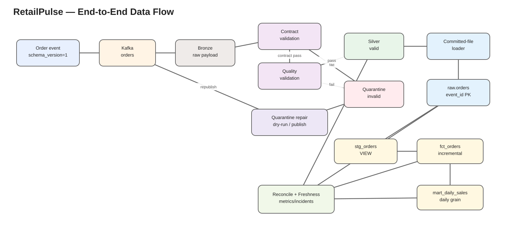

# RetailPulse Data Flow



Editable source: [`diagrams/data_flow.drawio`](diagrams/data_flow.drawio).

## 1. Event creation and publication

**Path:** `producer/src/producer.py`

The reference producer creates `schema_version=1`, `event_type=order_created` events. `event_id` and `order_id` are independently generated UUID4 strings. The Kafka message key is `order_id` and the JSON event is the value.

```text
create_order_event()
  ↓
KafkaProducer.send(topic="orders", key=order_id, value=event)
```

The finite benchmark interface is:

```cmd
python -m producer.src.producer --count 20 --interval 0 --quiet
```

or, for a larger controlled batch:

```cmd
python -m producer.src.producer --count 1000000 --interval 0 --quiet
```

## 2. Kafka → Bronze

**Path:** `spark/jobs/stream_orders_to_lake.py`

Spark subscribes to `orders` using `kafka:29092` inside Docker. With a fresh checkpoint it starts from `earliest`.

Bronze captures the raw message and lineage before domain acceptance:

```text
Kafka key/value/topic/partition/offset/timestamp
        ↓
build_bronze()
        ↓
data_lake/bronze/orders/ingestion_date=YYYY-MM-DD/
```

## 3. Parse and contract validation

`parse_orders()` parses the raw payload both as a string map and as the typed order struct. The map is retained so contract checks can distinguish missing source fields from typed parsing outcomes.

`add_contract_validation()` checks:

```text
valid JSON object
schema_version present
schema_version parseable and supported
required V1 fields present
```

Contract failure examples:

```text
contract_invalid_payload
contract_missing_schema_version
contract_invalid_schema_version
contract_unsupported_schema_version
contract_missing_event_id
...
```

Contract failures skip domain quality evaluation and go to Quarantine.

## 4. Domain quality validation

`add_validation()` applies the same domain expectations represented canonically in `spark/common/order_quality.py`:

```text
event_id nonblank
order_id nonblank
product_id nonblank
event_type = order_created
event_timestamp parseable
quantity > 0
unit_price > 0
currency = GBP
category in electronics/home/fashion/sports/books
```

`spark/tools/check_order_quality_parity.py` verifies the canonical Python rule results and Spark expression results remain aligned for representative cases.

## 5. Valid path → Silver

`build_silver()` keeps events with no contract or validation error and derives:

- `order_value = round(quantity * unit_price, 2)`
- `event_date`
- `ingestion_date`
- `ingestion_hour`

The output includes business fields plus Kafka lineage.

```text
data_lake/silver/orders/
  ingestion_date=YYYY-MM-DD/
    ingestion_hour=HH/
      *.parquet
      _spark_metadata/
```

The physical files are append-only streaming outputs. `_spark_metadata` defines which files are committed.

## 6. Invalid path → Quarantine

`build_quarantine()` stores rejected raw payloads with:

```text
schema_version
contract_error
validation_error
topic / partition / offset
kafka_timestamp
ingested_at
```

Operator remediation is provided by:

```text
warehouse/tools/reprocess_quarantine.py
```

The tool is dry-run by default, revalidates the repaired payload and writes an audit row to `control.event_reprocessing_log`. `--publish` republishes the repaired event to Kafka while preserving event identity/timestamp constraints enforced by the tool.

## 7. Silver → Raw

**Path:** `warehouse/loader/load_orders.py`

Normal mode:

```text
read loader watermark
  ↓
find eligible Silver hourly partitions
  ↓
filter physical files to Spark-committed set
  ↓
skip control.loaded_files entries
  ↓
insert rows to raw.orders
  ↓
ON CONFLICT(event_id) DO NOTHING
  ↓
record loaded file
  ↓
advance watermark
```

Historical backfill reads a bounded `--from/--to` range without advancing the live watermark. Replay additionally rereads already-registered files.

## 8. Raw → dbt analytics

### `analytics.stg_orders`

A view over `raw.orders` preserving the validated event-level grain and exposing dbt source/model tests.

### `analytics.fct_orders`

An incremental event-level fact table. New rows are selected where `loaded_at` is greater than the existing fact maximum. `event_id` is the dbt unique key and has a dbt-managed unique B-tree index.

### `analytics.mart_daily_sales`

A table grouped by `event_date`:

```text
order_count
units_sold
gross_revenue
average_order_value
```

## 9. Airflow orchestration

Every 10 minutes:

```text
start_pipeline_run
  ↓
run_incremental_loader
  ↓
validate_raw_orders
  ↓
run_dbt_build
  ↓
check_pipeline_health
  ↓
record_pipeline_metrics marker
  ↓
complete_pipeline_run
```

The loader can commit successfully even if the run later fails strict health because upstream/downstream layers are temporarily at different snapshots. Successful earlier task effects remain committed; the next scheduled run resumes from the durable loader state.

The 1M-event validation demonstrated exactly this:

```text
run 1: 730,822 inserted → strict health DEGRADED → run FAILED
run 2: 269,178 inserted → full reconciliation → SUCCEEDED / HEALTHY
```

## 10. Health and incident path

Every health execution:

```text
snapshot committed lake metrics
  +
query warehouse metrics
  ↓
evaluate reconciliation/freshness
  ↓
insert control.pipeline_metrics
  ↓
open/update/resolve control.pipeline_incidents
  ↓
send incident/recovery email when configured
  ↓
print HEALTHY / WARNING / DEGRADED
```

`DEGRADED` exits non-zero. `WARNING` represents tolerated live lag in non-strict mode and exits successfully.

## 11. Event identity and duplicate behaviour

Two different conditions are deliberately separated:

### Duplicate delivery

```text
same event_id delivered more than once
```

Allowed physically in Silver; collapsed at `raw.orders.event_id`.

### Business-key collision

```text
same order_id associated with multiple different event_id values
```

Rejected by dbt singular test `assert_unique_order_business_keys.sql` because it represents inconsistent business identity rather than delivery duplication.
